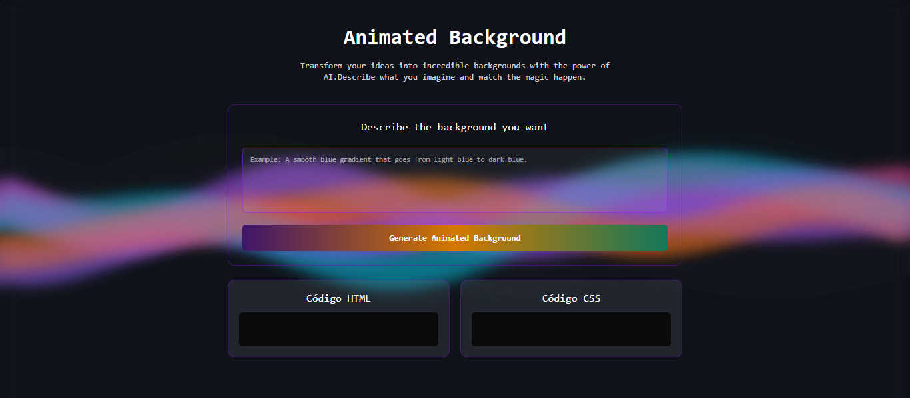
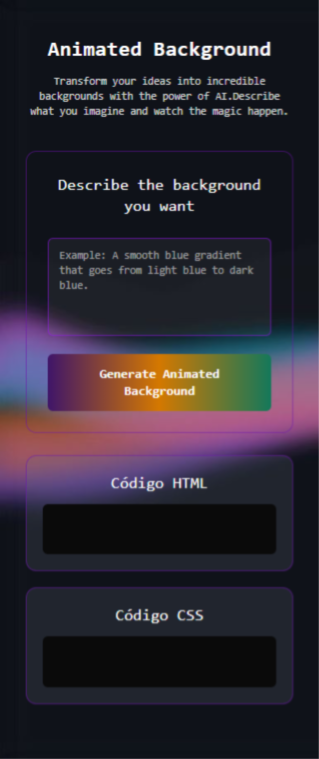

# 🎨 Animated Background — Gerador de Fundos Animados com IA

O Animated Background é uma aplicação web interativa que utiliza Inteligência Artificial integrada a um workflow automatizado no n8n, combinado com o modelo Google Gemini, para gerar backgrounds animados personalizados em CSS puro. Basta descrever o que você imagina e a IA cria automaticamente o código HTML e CSS necessário para dar vida à sua ideia.

📋 Índice

- Sobre o Projeto
- Funcionalidades
- Fluxo de Dados
- Tecnologias Utilizadas
- Ferramentas e Integrações
- Layouts
- Como Rodar Localmente
- Testes
- Roadmap
- Licença
- Contribuições
- Contato
- Autor

## ☝️ Sobre o Projeto <a id="sobre-o-projeto"></a>

**O Problema** 😬

_Criar animações CSS complexas e backgrounds dinâmicos pode ser:_

- ⏱️ Demorado e trabalhoso, horas ajustando keyframes e propriedades
- 🧠 Requer conhecimento avançado, domínio de CSS animations, transforms e gradients
- 🎨 Difícil de visualizar, ciclo lento de código → preview → ajuste
- 🔄 Iterações custosas, cada mudança exige reescrita manual

**A Solução** 💡

_Com Animated Background, você:_

- 📝 Descreve em linguagem natural o background que imagina
- 🤖 IA processa e gera código CSS otimizado instantaneamente
- 👁️ Visualiza o resultado aplicado em tempo real
- 📋 Copia o código HTML e CSS pronto para usar em qualquer projeto

## 🚀 Funcionalidades & Interatividades

#### 🎯 1. Geração Inteligente de Backgrounds

- O usuário descreve o background desejado em linguagem natural no textarea
- O sistema envia a descrição para um webhook n8n que realiza o processamento
- A IA interpreta o contexto e gera código HTML + CSS otimizado
- A resposta final renderiza o background animado na própria aplicação

_Exemplo de prompts:_ "_Um gradiente suave de azul para roxo com animação de ondas_"

#### ▶️ 2. Controles de Pesquisa

**Via Botão**:

- _Clique em "Generate Animated Background" dispara a geração_

**Durante o processo**:

- Botão desabilitado (previne múltiplas requisições)
- Texto muda para "Generating..."
- Textarea também desabilitado

_Ao finalizar, todos os controles voltam ao estado normal_

**Via Teclado**:

- Search dispara com a tecla Enter
- Quebra de linha com Shift + Enter
- Botão desabilitado quando textarea está vazio ou contém apenas espaços
- Validação em tempo real da entrada do usuário

#### 📤 3. Comunicação com IA

**Fluxo de Processamento**:

- Webhook recebe o prompt do usuário
- AI Agent (Google Gemini) interpreta e gera código
- Code Node limpa e formata a resposta (remove markdown, quebras de linha)
- Response Node retorna JSON estruturado

#### 🎨 4. Visualização em Tempo Real

- Background aplicado dinamicamente via dangerouslySetInnerHTML
- CSS injetado no <head> do documento
- Renderização instantânea sem reload da página
- Múltiplas gerações substituem o background anterior (não acumulam)

#### 📋 5. Sistema de Cópia

**Copy to Clipboard**:

- Botão "Copiar" em cada seção (HTML e CSS)
- Feedback visual instantâneo:
  - Ícone muda para ✓ (check)
  - Texto muda para "Copiado!"
  - Retorna ao estado normal após 2 segundos
- Tratamento de erros do Clipboard API

#### 🎭 6. Exibição de Código

**Informações Exibidas:**

- Código HTML completo (estrutura das divs)
- Código CSS completo (estilos e animações)
- Sintaxe preservada (indentação, quebras de linha)
- Scroll automático para códigos longos

_Interface_:

- Seções lado a lado (desktop)
- Empilhadas verticalmente (mobile)
- Fundo escuro com syntax highlighting visual
- Texto em monospace para melhor legibilidade

## 🧠 Fluxo de Dados da Aplicação

````
Usuário → Digita descrição no textarea
    ↓
App.tsx → Estado gerencia backgroundHtml e backgroundCss
    ↓
Main Component → Captura input e dispara requisição
    ↓
POST → Webhook N8N
    ↓
N8N Workflow:
  1. Webhook Node → Recebe descrição
  2. AI Agent → Google Gemini processa prompt
  3. Code Node → Limpa resposta (remove ``` e \n)
  4. Response Node → Retorna JSON { code, style, preview }
    ↓
App.tsx → Recebe dados via callback handleBackgroundGenerated()
    ↓
Renderização:
  - Background renderizado em <div> com dangerouslySetInnerHTML
  - CSS injetado em <style> no document.head
  - Código exibido no CodeOutput Component
    ↓
Usuário → Visualiza resultado e copia código
````

## 🛠️ Tecnologias Utilizadas


### 🧩 _Frontend_

| Tecnologia      | Versão | Função                                                         |
| --------------- | -----: | -------------------------------------------------------------- |
| **React**       | 18.3.1 | Biblioteca para construção de UI com componentes reutilizáveis |
| **TypeScript**  |  5.6.2 | Superset JavaScript com tipagem estática para maior segurança  |
| **Vite**        |  6.0.1 | Build tool ultra-rápido com HMR instantâneo                    |
| **TailwindCSS** | 3.4.17 | Framework CSS utility-first para estilização rápida            |

### 🤖 _Backend/IA_

| Tecnologia        | Função                                                                   |
| ----------------- | ------------------------------------------------------------------------ |
| **n8n**           | Plataforma de automação para orquestração do workflow                    |
| **Google Gemini** | Modelo de IA para interpretação de linguagem natural e geração de código |
| **Webhook**       | Endpoint HTTP para comunicação assíncrona                                |

### 🧪 _Testes_

| Tecnologia          | Versão | Função                                       |
| ------------------- | -----: | -------------------------------------------- |
| **Jest**            |   29.x | Framework de testes unitários                |
| **Testing Library** |   14.x | Utilitários para testes de componentes React |
| **ts-jest**         |   29.x | Pré-processador TypeScript para Jest         |

## 🔧 Ferramentas e Integrações

#### _Desenvolvimento_


#### _Hospedagem e Deploy_


> _URL :_ https://animated-background-pi.vercel.app/

### _APIs e Serviços_


## 🖼️ Layouts

| 💻 Desktop                                          | 📲 Mobile                                         |
| --------------------------------------------------- | ------------------------------------------------- |
|  |  |

## 💻 Como Rodar o Projeto Localmente

_*Pré-requisitos*_

> - **Node.js** >= _18.0.0_
> - **npm** >= _9.0.0_

### Instalação

```bash
# 1. Clone o repositório
git clone https://github.com/seu-usuario/animated-background.git

# 2. Acesse a pasta do projeto
cd animated-background

# 3. Instale as dependências
npm install

# 4. Inicie o servidor de desenvolvimento
npm run dev
```

```bash
Scripts Disponíveis

npm run dev          # Inicia servidor de desenvolvimento

# Build
npm run build        # Gera build de produção
npm run preview      # Preview do build de produção

# Testes
npm test             # Executa testes
npm run test:watch   # Modo watch (re-executa ao salvar)
npm run test:coverage # Relatório de cobertura

# Qualidade de Código
npm run lint         # Executa linter
```

## 🧪 Testes

_*Executar Testes*_

```bash
# Todos os testes
npm test

# Modo watch
npm run test:watch

# Com cobertura
npm run test:coverage

# Teste específico
npm test Header
```

> **Total**: _25 testes unitários focados em comportamento_

## 🗺️ Roadmap

#### Versão 1.1 (Próxima Release)

    Histórico de backgrounds gerados
    Sistema de favoritos com LocalStorage
    Mais templates pré-definidos
    Export para diferentes formatos (PNG, SVG, CodePen)

#### Versão 1.2

    Autenticação de usuários
    Galeria pública de backgrounds
    Sistema de likes e compartilhamento
    API pública para desenvolvedores

### Versão 2.0

    Editor visual de backgrounds
    Suporte a animações mais complexas (Lottie, GSAP)
    Integração com Figma
    Versão desktop (Electron)

#### Backlog

    Temas claro/escuro
    Internacionalização (i18n) - PT, EN, ES
    PWA (Progressive Web App)
    Tutorial interativo para novos usuários

## 📄 Licença

Este projeto está licenciado sob a [Licença MIT](https://opensource.org/) - veja o arquivo LICENSE para mais detalhes.

## 🤝 Contribuições

> Contribuições são sempre bem-vindas! Siga os passos abaixo:

### 🤔 Como Contribuir

```bash
## Fork o projeto

# Crie uma branch para sua feature
(git checkout -b feature/MinhaFeature)

# Commit suas mudanças
(git commit -m 'feat: adiciona nova feature')

# Push para a branch
(git push origin feature/MinhaFeature)

# Abra um Pull Request

# Padrão de Commits
Conventional Commits:

feat: nova funcionalidade
fix: correção de bug
docs: documentação
style: formatação de código
refactor: refatoração
test: testes
chore: tarefas gerais
```

## 📬 Contato

<div align="center">

> ### Se quiser conversar sobre o projeto ou tecnologia, entre em contato comigo:

  <a href="https://github.com/cledeocirmarafao" target="_blank">
    
  </a>
  <a href="https://www.linkedin.com/in/cledeocir-maraf%C3%A3o-267768193/" target="_blank">
    
  </a>
</div>

## ✨ Autor

**Cledeocir Marafão** — `Desenvolvedor Fullstack[ Em formação ]`
